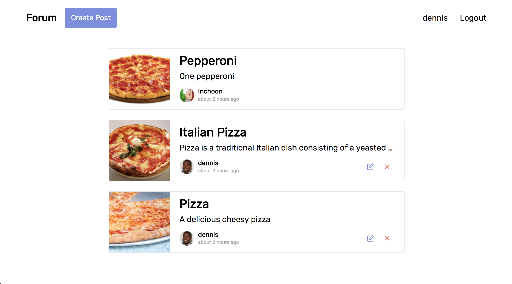
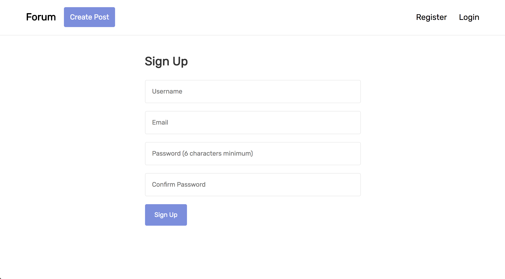
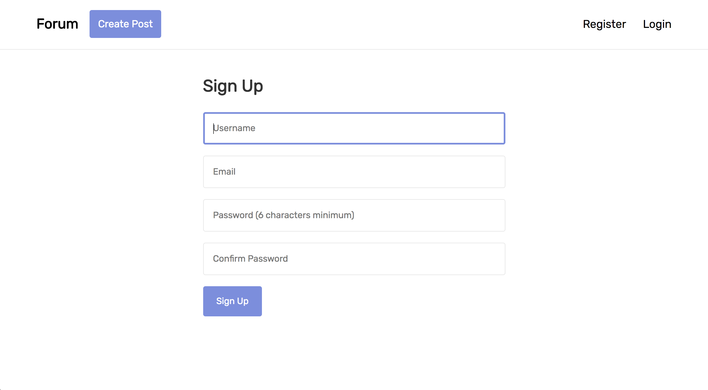
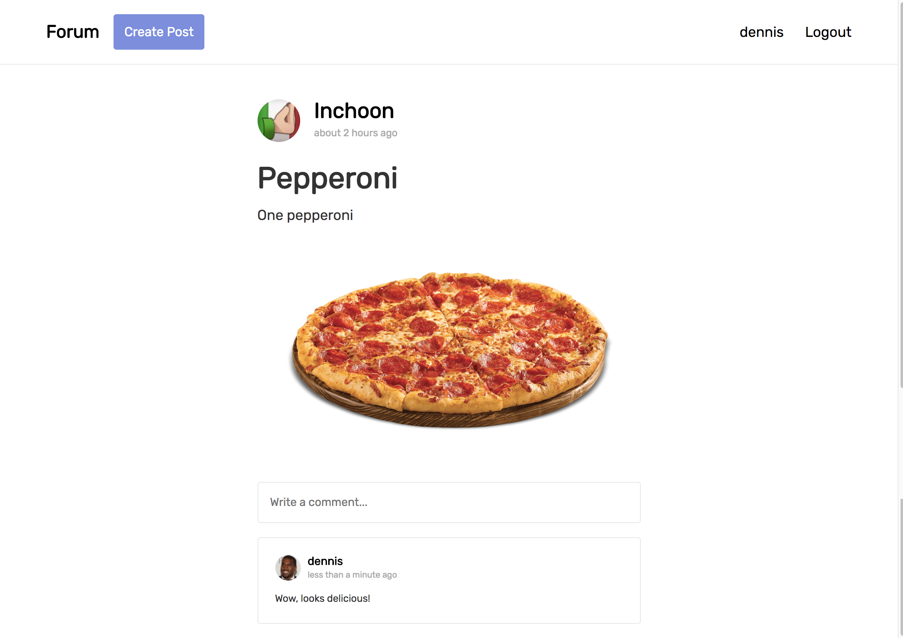
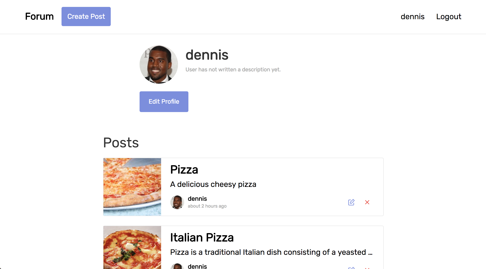
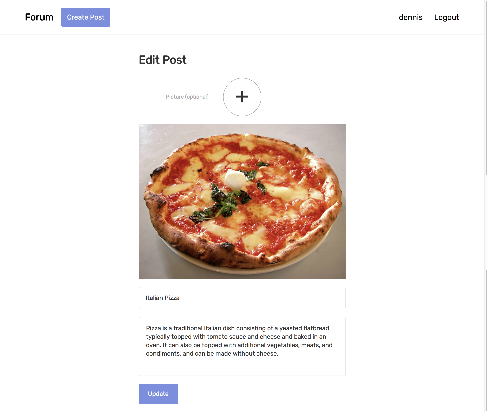

# Blueprint Forum

This is my optional project for Blueprint. I created forum where users can create posts and comment on other posts. Picture posts are supported using Paperclip.

This is a picture of the home page. Visitors can see posts ordered by date.

This is a picture of the signup page. Visitors can use this page to signup for the forum. I designed the interface with a focus on simplicity and ease of use.

For all inputs on this forum, once selected, a blue border forms around the input.

Once a post is clicked on, visitors can see a full sized version of the photo if a photo is attached to the post as well as the comments associated with the post.

By going to a user's profile, visitors can see the user's profile picture, description, and posts.

If a user wants to edit his or her post, he or she can use this form to edit the photo, heading and description of the post.
